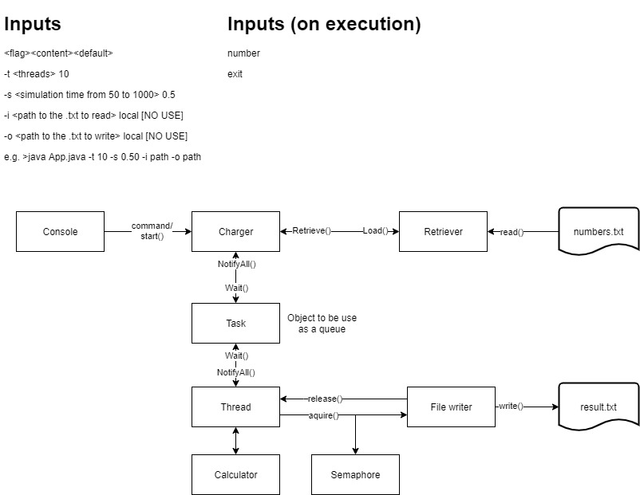
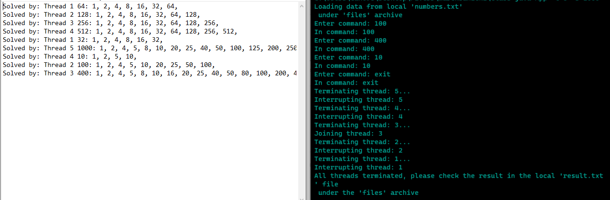

# Java: Write into a file using multiple threads
This is a simulation on how multiple threads works syncronized to write into the same file. This small excercise shows how to use the program and how it works. (Not using any package manager, just flat command promt)

##### Quick run

`WITH JAVA 15`

`$- java App -t 5 -s 50`

## Java
Using threads from java and the notify()-wait() functions and the semaphore class to control the resources consumption. 

## Problem
The idea is to use the threads to simulate a complex number calculation, said number comes from an input file "number.txt", then this numbers are stored in a queue waiting tobe recolected by a thread, when calculated the thread attemps to write the result in output file "output.txt". Let me describe this problem as a sequence of steps:

1. The programs reads the file.
2. All numbers are saved in a queue.
3. Threads can recolect a number each.
4. Every thread simulates a complex calculation.
5. Threads attemp to write the result in a file.
6. While all above happens the user can insert new numbers into the queue.
7. The program finishes when the queue is empty.


## Rules
 * The program must run with the user being able to insert a number into the queue. 
 * Amount of Threads used are set by the user.
 * Amount of time in miliseconds per thread to simulate complx calculations is set by the user.
 * No errors when the result is written.
 * Total control over wich thread is using the output file.
 * Threads must syncronize when recollecting its number.
 * The results must say which thread solved it.
 * The user interface must not freeze.

## Solution


### Calculator

For this solution the number calculation is using a divisor finder. Find all divisors of a number, every time a divisor is found the thread will sleep **simulationTime = s** miliseconds.

```java
@param number: int
@param simulationTime: int
@return array: int
...
int[] divisors = {...};
for(int i = 1 ; i <=number ; i++){
    if(number%i==0){
        try{
            Thread.sleep(simulationTime);
        }catch(Exception e){}
        divisors.add(i);
    }
}
return divisors;
...
```

## Usage
The solution is build so the user can configure different parts of the program before running.

#### Flags
- `-t <threads>`
- `-s <simulation-time>`
- `-i <input-file.txt> (deprecated)`
- `-o <output-file.txt> (deprecated)`

#### Execution

To start the program you can run 

`$- java App -t 5 -s 50` 

to indicate a threaded simulation with **5 threads** and each thread will take **50 miliseconds** for every time it finds part os the solution.

#### Result



## Conclusion

Overall the solution to the exercise is good, probably 8/10, this is because it has a few problems:

* The solution doesn't show important messages such as the progress of threads.
* Input numbers can be added to the queue only if a thread is free to work.
* The program might crash when the user spam input numbers.

## Additional information

This exercise was made as part of a simple class assigment, so you probably will find feedback like comments. 

Made by freelancer -josucano on fiverr.